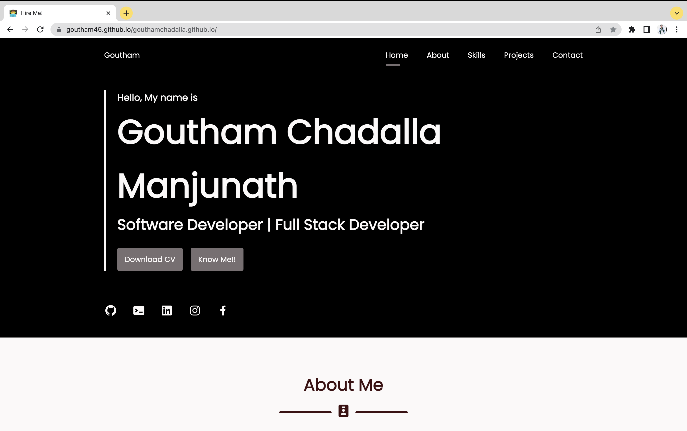

# Personal Portfolio ⚡️ 
> A clean, beautiful, responsive portfolio template for Software Developers!

> https://github.com/goutham45/gouthamchadalla.github.io

### Website Preview

 
  <kbd>
    
  </kbd>

## Features 📋
⚡️ Fully Responsive\
⚡️ Valid HTML5 & CSS3\
⚡️ Easy to modify

## Sections 📚
✔️ About me\
✔️ Experience\
✔️ Portfolio - Projects \
✔️ Skills \
✔️ Education\
✔️ Contact \
✔️ Resume

To view a live example, **[click here](https://goutham45.github.io/gouthamchadalla.github.io/)**

## Tools Used 🛠️
* [<b>GitHub Pages</b>](https://create-react-app.dev/docs/deployment/#github-pages) - To host my static website (HTML, CSS, JS).
* [<b>Materialize</b>](https://materializecss.com/) - A CSS framework to get Google's Material Design components.

## License 📄
This project is licensed under the MIT License - 

MIT License

Copyright (c) 2023 Goutham Chadalla Manjunath

Permission is hereby granted, free of charge, to any person obtaining a copy
of this software and associated documentation files (the "Software"), to deal
in the Software without restriction, including without limitation the rights
to use, copy, modify, merge, publish, distribute, sublicense, and/or sell
copies of the Software, and to permit persons to whom the Software is
furnished to do so, subject to the following conditions:

The above copyright notice and this permission notice shall be included in all
copies or substantial portions of the Software.
